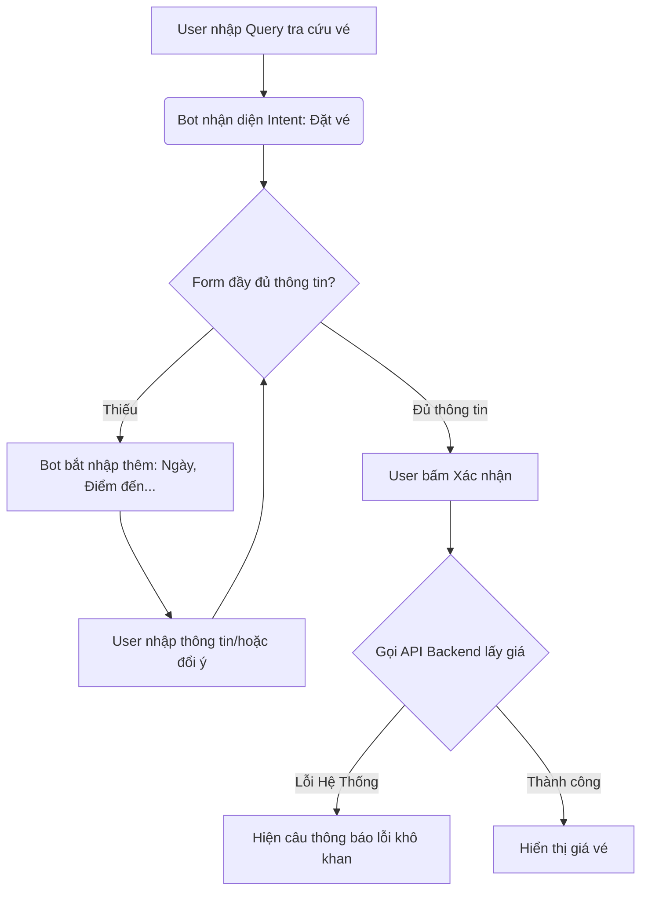

# [Individual Workshop] AI App Teardown: Trợ lý ảo NEO (Vietnam Airlines)

- **Họ và tên:** Nguyễn Xuân Tài
- **Mã học viên:** 2A202600621
- **Sản phẩm kiểm thử:** Trợ lý ảo NEO - Vietnam Airlines (Kênh Web)
- **Ngày thực hiện:** 03/06/2026

---

## 1. Xác định "Cam kết sản phẩm" (Promise) vs Thực tế

* **Promise (Kỳ vọng):** Theo giới thiệu từ hãng, NEO hỗ trợ tra cứu thông tin vé máy bay, hành trình, tìm kiếm giá vé tốt nhất và giải đáp thắc mắc về hành lý tự động 24/7.
* **Thực tế trải nghiệm (As-is):** Hệ thống hoạt động theo dạng rule-based kết hợp LLM thu thập thông tin dạng slot-filling (bắt điền đủ điểm đi, điểm đến, ngày đi mới trả kết quả). Khả năng xử lý các câu hỏi mang tính chất "khảo sát, ước lượng" hoặc thay đổi ý định giữa chừng còn rất yếu, dễ dẫn đến vòng lặp vô hạn hoặc sập luồng (system error).

---

## 2. Nhật ký tương tác & Các Điểm gãy (Failure Modes)

Tôi đã thực hiện kiểm thử hệ thống với chuỗi hội thoại thực tế nhằm ép mô hình bộc lộ điểm gãy ngầm:

### Kịch bản Test 1: Đổi ý định giữa chừng (Intent Drift) và Ép nhập thông tin sai định dạng

* **User:** *"tìm giá vé trung bình và lộ trình từ hà nội đi đức, cho biết mức giá có dao động nhiều trong năm không và thường rẻ nhất khi nào"*
* **Bot (NEO):** Tự động bóc tách và bắt liên tục điền thông tin còn thiếu (Thành phố cụ thể tại Đức, ngày đi, số hành khách).
* **User:** *"không cần, xem giá vé trung bình thôi"* -> **[Điểm gãy 1 - Lỗi Intent]**: Bot không hiểu user muốn bỏ qua bước điền form, tiếp tục lặp lại câu lệnh bắt nhập thông tin cũ (Vòng lặp slot-filling).
* **User:** Đổi ý định: *"tôi muốn đổi sang đi trung quốc vào tháng tới"*
* **Bot (NEO):** Tiếp tục bắt nhập thông tin thành phố cụ thể tại Trung Quốc.
* **User:** Đưa thông tin sai lệch: *"thế đi ngày 32/7 nhé"* -> **[Điểm gãy 2 - Lỗi Validation]**: Bot nhận diện được ngày không hợp lệ nhưng UX chỉ hiện một dòng text nhắc nhở khô khan, không có nút điều hướng lại luồng chọn ngày.

### Kịch bản Test 2: Sập luồng hệ thống ở bước thực thi (Data/Tool Integration Failure)

* **User:** Cung cấp thông tin hợp lệ sau nhiều bước: *"đi ngày 31/8"*
* **Bot (NEO):** Hiển thị bảng tổng hợp thông tin (Hà Nội -> Vân Nam, 1 người, 31/08/2026) và yêu cầu *"Vui lòng xác nhận thông tin trên"*.
* **User:** *"xác nhận thông tin"*
* **Bot (NEO):** *"Rất tiếc, hệ thống hiện gặp lỗi và không thể tìm kiếm được giá vé phù hợp..."* -> **[Điểm gãy 3 - Lỗi Tầng Data/Backend]**: Gây đứt gãy trải nghiệm nghiêm trọng (False Positive/Failure Path) sau khi user đã mất rất nhiều bước để điền form.

---

## 3. Bản đồ Luồng vận hành hiện tại (As-is Flow)

